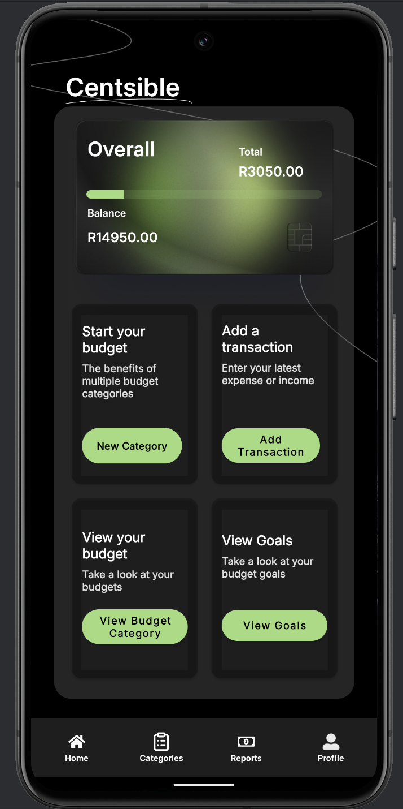

Centsible - Budget Tracker App
------------------------------------------------------

Centsible is a personal budgeting and expense tracking Android application focused on functionality, data persistence, and a user-friendly experience. 
The app helps users stay on top of their finances by organizing their expenses, setting spending goals, and viewing summaries of their financial habits.

------------------------------------------------------

Key Features
------------------------------------------------------
- **Secure Authentication** – Username/password login with session management.  
- **Category Management** – Create, edit, delete custom budget categories.  
- **Transaction Logging** – Track expenses by date, time, description, category, and photo.  
- **Budget Goals** – Define monthly min/max limits and receive timely alerts.   
- **Gamification** – Badges, progress bars, and notifications to keep you motivated.

## Demo Video

🎥 [Click here to watch the Demo](https://youtu.be/irYLi_9jh4k)

## Screenshots

| Welcome | Home  | Category | Profile |
|-----------|------------------|-------------------------|-------------------|
|  |  |  | |

| Graphs | Health  | Currency | Acheivements |
|-----------|------------------|-------------------|-------------------|
|  |  |  | |

---


## Installation

### Prerequisites
- Java Development Kit (JDK) 11 or later  
- Android Studio Arctic Fox (or later)  
- Gradle 7.x  

### Clone the repository
```bash
git clone https://github.com/st10194321/centsibletest.git
cd centsibletest
```

### Open in Android Studio
- Select **"Open an existing project"**, navigate to the `centsibletest` folder, and let Gradle sync.  
- Ensure the Android SDK and emulator (or a device) are configured.

### Build & Run
```bash
./gradlew installDebug
```
The app will launch on your emulator or connected device.

### Tech Stack
- **Language**: Kotlin + XML
- **Database**: RoomDB
- **Authentication**: Firebase Authentication
- **Storage**: Firebase Firestore
- **Version Control**: GitHub 

## Usage

Follow these steps to get started with Centsible:

1. **Register / Login**  
   - On first launch, tap **Register** to create an account with a username and password.  
   - Afterwards, use **Login** to access your dashboard.

2. **Create a Budget Category**  
   - Navigate to **Categories** from the bottom menu.  
   - Tap **+ Add Category**, enter a name (e.g., “Groceries”), choose whether it’s an Expense or Savings, then save.

3. **Record a Transaction**  
   - Go to **Transactions** and tap **+ New Expense**.  
   - Enter date, time, description, select the category, optionally attach a photo of your receipt, and save.

4. **Set Monthly Budget Goals**  
   - In **Goals**, tap **Set Goal** for any category.  
   - Specify minimum and maximum spend limits for the month to receive alerts as you approach them.

5. **View Your Entries**  
   - The **Transactions** list shows all entries for the selected period.  
   - Tap any entry to view details and attached receipt images.

6. **Earn Badges & Notifications**  
   - Reach milestones (e.g., “Under Budget 3 Months”) to earn badges.  
   - Receive push notifications when you’re nearing your budget limit.


### Documentation

Link to detailed docs or a GitHub Pages site:

- [User Guide](https://github.com/ST10194321/CentsibleTest/blob/main/user-guide.pdf)  


### Changelog

Maintain a **CHANGELOG.md** to track releases:

```markdown
## [1.0.0] – 2025-05-01
### Added
- Initial release with core budgeting features.
```
## Contributers
- Ayushkar Ramkissoon: ST10036346
- Ethan Pillay: ST10258615
- José Gonzalves: ST10194321
- Quellon Naicker: ST10340880

## Conclusion

With this README, new users can understand Centsible’s purpose, get it running locally, and start budgeting smarter. 

