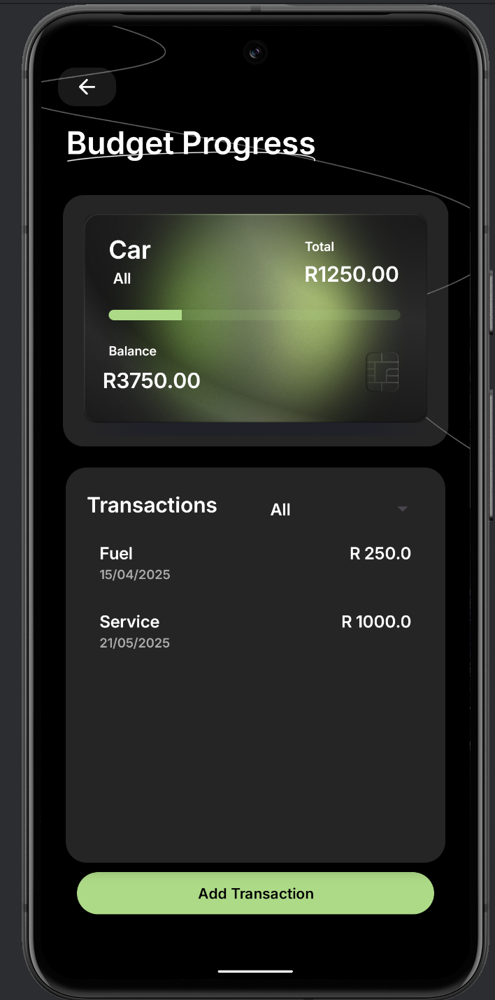
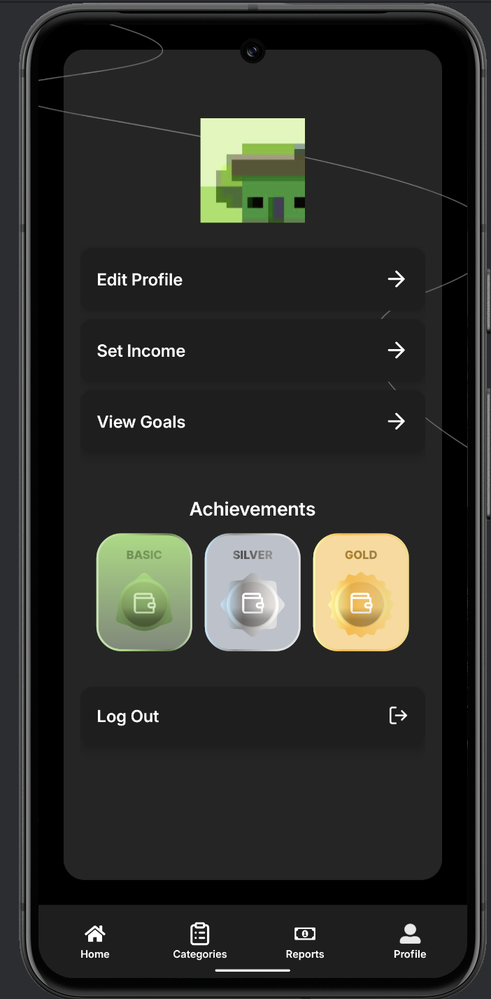

Centsible - Budget Tracker App
------------------------------------------------------

Centsible is a personal budgeting and expense tracking Android application focused on functionality, data persistence, and a user-friendly experience. 
The app helps users stay on top of their finances by organizing their expenses, setting spending goals, and viewing summaries of their financial habits.

------------------------------------------------------

Key Features
------------------------------------------------------
- **Secure Authentication** – Username/password login with session management and biometrics.  
- **Category Management** – Create, edit, delete custom budget categories.  
- **Transaction Logging** – Track expenses by date, time, description, category, and photo.  
- **Budget Goals** – Define monthly min/max limits and receive timely alerts.   
- **Gamification** – Badges, progress bars, and notifications to keep you motivated.

  
## Additional Features
------------------------------------------------------

### 1.Biometric Login  
Users can log in using fingerprint authentication after initial sign-up, providing a faster and more secure experience.

### 2.Currency Conversion  
All financial data in the app (transactions, graphs, budget goals, health, etc.) can be dynamically converted to your chosen currency.  
- **Base currency**: South African Rand (ZAR)  
- **Available in the Profile section**

### 3.Financial Health Calculator  
After setting your monthly income, the app evaluates your financial behavior and generates a **health score (e.g., 98/100)** based on income vs. expenses.  
The health screen includes:
- Savings rate percentage  
- Budget used percentage  
- Personalized tips on how much you've saved, how much you can spend per day, and other insights  

---

## Gamification
------------------------------------------------------

Centsible includes gamification elements to keep users motivated and engaged.

### Achievement Badges  
Users unlock achievements based on their budgeting habits:
- **First Steps** (Basic)
- **Budget Beginner** (Silver)
- **Smart Spender** (Gold)

Badges are awarded for staying under your max and min budget goals and maintaining consistent financial habits.

---
## Demo Video

🎥 [Click here to watch the Demo](https://youtu.be/df5fGuT8DAk)

## Screenshots

| Welcome | Home  | Category | Profile |
|-----------|------------------|-------------------------|-------------------|
|  |  |  | |

| Graphs | Health  | Currency | Acheivements |
|-----------|------------------|-------------------|-------------------|
|  |  |  | |

---
## Design Implementations
------------------------------------------------------

The **Centsible Budgeting Application** adheres to modern design principles to create an intuitive, clean, and user-friendly interface. The design focuses on clarity, accessibility, and engagement, enabling users to navigate the app easily while taking control of their financial well-being.  


### Logo 


- The **Centsible** logo features a stylized “C” that resembles a cent symbol (¢), immediately conveying that the app is focused on money management. The primary logo color is
  **green (#A1DC7C)**, symbolizing financial growth and stability. This color choice ties into the global association of green with currency and prosperity.  

---

### Colour Scheme

| Color      | Hex Code   | Usage & Justification |
|------------|------------|------------------------|
| **Green**  | `#A1DC7C`  | Used for buttons, progress bars, and key highlights. Evokes growth and financial positivity.|
| **Black**  | `#000000`  | Main background color. Provides strong contrast and enhances text readability, critical for financial clarity.|
| **Grey**   | `#3A3A3A`  | Used for secondary text and icons. Offers a subtle visual hierarchy without distracting from core elements. |
| **White**  | `#FFFFFF`  | Primary text color. Enhances readability against dark backgrounds, maintaining a bold and professional appearance. |

---

The design choices reflect a careful balance between aesthetic appeal and usability, ensuring that users can focus on their budgeting goals without distraction. The use of a consistent color scheme, clean typography, and logical spacing contributes to a visually harmonious and effective user experience.


## Installation

### Prerequisites
- Java Development Kit (JDK) 11 or later  
- Android Studio Arctic Fox (or later)  
- Gradle 7.x  

### Clone the repository
```bash
git clone https://github.com/st10194321/centsibletest.git
cd centsibletest
```

### Open in Android Studio
- Select **"Open an existing project"**, navigate to the `centsibletest` folder, and let Gradle sync.  
- Ensure the Android SDK and emulator (or a device) are configured.

### Build & Run
```bash
./gradlew installDebug
```
The app will launch on your emulator or connected device.

### Tech Stack
- **Language**: Kotlin + XML
- **Database**: RoomDB
- **Authentication**: Firebase Authentication
- **Storage**: Firebase Firestore
- **Version Control**: GitHub 

## Usage

Follow these steps to get started with Centsible:

1. **Register / Login**  
   - On first launch, tap **Register** to create an account with a username and password.  
   - Afterwards, use **Login** to access your dashboard.
   - Users can log in using biometrics (fingerprint) once they have signed up

2. **Create a Budget Category**  
   - Navigate to **Categories** from the bottom menu.  
   - Tap **+ Add Category**, enter a name (e.g., “Groceries”), choose whether it’s an Expense or Savings, then save.

3. **Record a Transaction**  
   - Go to **Transactions** and tap **+ New Expense**.  
   - Enter date, time, description, select the category, optionally attach a photo of your receipt, and save.

4. **Set Monthly Budget Goals**  
   - In **Goals**, tap **Set Goal** for any category.  
   - Specify minimum and maximum spend limits for the month to receive alerts as you approach them.

5. **View Your Entries**  
   - The **Transactions** list shows all entries for the selected period.  
   - Tap any entry to view details and attached receipt images.
  
6. **Reports**
   - The **Reports** page shows two graphs that visualize their spending habits.
   - Pie Chart - showing expenses per category
   - Bar Graph - showing the total budget vs total expenses with added visualization of their max and min goals limit on the bar graph.
  
7. **Currency Conversion**
   - Users can select the display currency in profile section.
   - The currency will change for all the amounts automatically.
  
8. **Financial Health**
   - Set your monthly income.
   - The **Financial Health** will give you an overall health score based on your income vs expenses.
   - This page will also give you tips based on your spending habits.

10. **Earn Badges & Notifications**  
   - Reach milestones (e.g., “Budget Beginner”) to earn badges.  
   - Receive push notifications when you’re nearing your budget limit.


### Documentation

Link to detailed docs or a GitHub Pages site:

- [User Guide](https://github.com/ST10194321/CentsibleTest/blob/main/user-guide.pdf)  


### Changelog

Maintain a **CHANGELOG.md** to track releases:

```markdown
## [1.1.0] – 2025-05-01
### Added
- 2nd release with added budgeting features.
```
## Contributers
- Ayushkar Ramkissoon: ST10036346
- Ethan Pillay: ST10258615
- José Gonzalves: ST10194321
- Quellon Naicker: ST10340880

## Conclusion

With this README, new users can understand Centsible’s purpose, get it running locally, and start budgeting smarter. 

## References

- Android Developers, 2025. Achievements. Android Developers. [online] Available at: <<https://developer.android.com/games/pgs/achievements>> [Accessed 3 Jun. 2025].

- Android Developers, 2025. Photo basics (Camera deprecated). Android Developers. [online] Available at: <<https://developer.android.com/media/camera/camera-deprecated/photobasics#kotlin>> [Accessed 1 May 2025].

- Kotlin Documentation Team, 2025. coerceIn - Kotlin Standard Library. Kotlin.org. [online] Available at: <<https://kotlinlang.org/api/core/kotlin-stdlib/kotlin.ranges/coerce-in.html>> [Accessed 21 Apr. 2025].

- Chetan R, 2013. Datepicker - How to popup DatePicker when entering EditText. Stack Overflow. [online] Available at: <<https://stackoverflow.com/questions/14933330/datepicker-how-to-popup-datepicker-when-entering-edittext>> [Accessed 21 Apr. 2025].

- Android Developers, 2025. Currency class reference. Android Developers. [online] Available at: <<https://developer.android.com/reference/android/icu/util/Currency>> [Accessed 9 Jun. 2025].

- Firebase Documentation Team, 2025. Get a document. Firebase. [online] Available at: <<https://firebase.google.com/docs/firestore/query-data/get-data#get_a_document>> [Accessed 20 Apr. 2025].

- GeeksforGeeks, 2025. How to make a Scientific Calculator Android App using Kotlin? GeeksforGeeks. [online] Available at: <<https://www.geeksforgeeks.org/how-to-make-a-scientific-calculator-android-app-using-kotlin/>> [Accessed 5 Jun. 2025].

- Cowan, J., 2021. Android Kotlin get value of selected Spinner item. Stack Overflow. [online] Available at: <<https://stackoverflow.com/questions/65556362/android-kotlin-get-value-of-selected-spinner-item>> [Accessed 24 Apr. 2025].

- Miller, D., 2025. jBCrypt – Java implementation of OpenBSD’s Blowfish password hashing. Mindrot.org. [online] Available at: <<https://www.mindrot.org/projects/jBCrypt/>> [Accessed 10 Apr. 2025].

- Thornsby, J., 2025. How to add fingerprint authentication to your Android app using BiometricPrompt. Android Authority. [online] Available at: <<https://www.androidauthority.com/add-fingerprint-authentication-app-biometricprompt-943784/>> [Accessed 29 May 2025].

